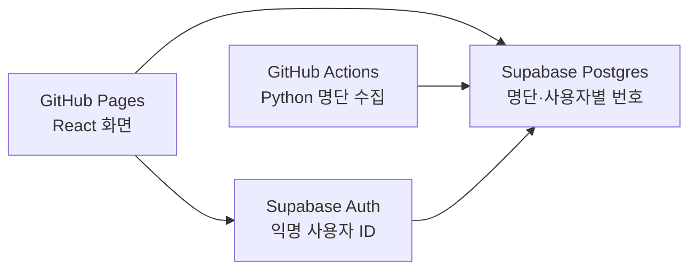

# GitHub Pages 배포 및 사용자별 기록 저장 계획

작성 기준: 2026-09-24  
상태: 배포용 파일 구현 완료. Supabase SQL 실행, 익명 로그인 활성화, GitHub Secrets 등록이 남아 있다.

## 1. 목표와 현재 구조

원본 로컬 프로젝트는 React 화면, Python API, KBO 명단 수집기와 SQLite로 동작한다. 이 배포 복사본은 React가 Supabase에 직접 연결되도록 바꾸었고, 날짜 카드의 **저장** 버튼도 `saved_draws`에 연결했다. `automation/sync_supabase.py`와 GitHub Actions가 KBO 명단 및 전날 조건별 번호를 채운다.

GitHub Pages에는 React 빌드 결과를 올린다. GitHub Pages는 Python 등 서버 코드를 실행하지 않으므로, 현재의 `/api/week`·`/api/redraw` 요청과 로컬 SQLite 저장을 그대로 배포할 수 없다. [GitHub Pages 문서](https://docs.github.com/en/pages/getting-started-with-github-pages/creating-a-github-pages-site)

## 2. 권장 구성

| 역할 | 담당 | 주요 내용 |
| --- | --- | --- |
| 화면 배포 | GitHub Pages | Vite로 빌드한 정적 React 파일 제공 |
| 사용자 구분 | Supabase Auth | 첫 방문 시 익명 로그인으로 고유 사용자 ID 발급; 원하면 나중에 이메일 연결 |
| 데이터 저장 | Supabase Postgres | 날짜별 KBO 명단, 조건별 고정 번호, 개인별 재추첨·저장 기록 보관 |
| KBO 명단·자정 결과 생성 | GitHub Actions | 기존 Python 코드를 정기 실행해 팀·날짜별 명단과 전날의 160개 조건 결과를 DB에 기록 |

GitHub Actions의 예약 실행은 지연될 수 있다. 따라서 DB에서 한국 시간 00:00 이후 과거 날짜의 재추첨·수정을 먼저 차단하고, 작업이 실행되면 누락된 결과를 채운다. 화면에는 **마지막 명단 갱신 시각**을 표시하고, 수집 실패 시 기존에 검증된 명단을 유지한다. 수동 재실행도 설정한다. [GitHub Actions 예약 실행 문서](https://docs.github.com/en/actions/reference/workflows-and-actions/events-that-trigger-workflows)

## 3. IP 주소를 사용자 ID로 사용하지 않는 이유

IP 주소는 한 사람에게 고정된 식별자가 아니다. 가정·회사·학교의 여러 사람이 같은 공인 IP를 사용할 수 있고, 이동통신망이나 접속 환경 변경으로 같은 사람의 IP가 달라질 수 있다. IP별로 기록을 조회하면 **서로 다른 사람의 번호가 섞이거나 본인 기록이 사라진 것처럼 보일 수 있다.** 주소 공유의 문제는 [IETF RFC 6269](https://www.rfc-editor.org/rfc/rfc6269.html)에도 설명되어 있다.

브라우저가 전달한 IP 문자열을 믿고 개인 기록의 접근 권한을 정할 수도 없다. 따라서 IP는 개인 기록의 기본키나 조회 권한의 근거로 사용하지 않는다. 접속 제한이 필요해지는 경우에만 서버 측에서 별도로 다룬다.

**권장 대안은 익명 사용자 ID다.** Supabase의 익명 로그인은 이메일 입력 없이 고유 ID와 인증 토큰을 제공하며, 나중에 이메일 등 로그인 수단을 연결할 수 있다. 다만 익명 상태에서 브라우저 데이터를 지우거나 다른 기기를 쓰면 같은 계정으로 돌아올 수 없으므로, 장기 보관이 필요할 때 이메일 연결을 안내한다. [Supabase 익명 로그인 문서](https://supabase.com/docs/guides/auth/auth-anonymous)

## 4. 저장할 데이터

| 테이블 | 핵심 필드 | 용도 |
| --- | --- | --- |
| `roster_snapshots` | KBO 기준 날짜, 팀, 1군 번호 배열, 퓨처스 번호 배열, 수집 시각 | 그날의 추첨 후보를 고정한다. 일반 사용자는 읽기만 가능하다. |
| `daily_results` | 추첨 날짜, 팀, 1군 선수 수, 영구결번 포함 여부, 번호 6개와 각 번호의 출처·선수명, 명단 기준 날짜 | 모든 사용자에게 공통으로 제공하는 고정 결과. 하루 160개 조건을 채우고 기존 결과는 덮어쓰지 않는다. |
| `user_draws` | 사용자 ID, 추첨 날짜, 팀, 조건, 번호 6개와 출처·선수명, 수정 시각 | 사용자가 오늘 뽑거나 다시 뽑은 개인 결과. 날짜가 바뀌면 수정할 수 없다. |
| `saved_draws` | 사용자 ID, 추첨 날짜, 팀, 추첨 조건, 번호 6개와 출처·선수명, 명단 기준 날짜, 저장 시각 | 날짜 카드의 **저장** 버튼을 눌러 확정한 기록. 같은 사용자·날짜·팀·조건 조합은 한 건으로 둔다. |

번호 출처와 선수 이름을 결과에 함께 저장한다. 그래야 명단이 나중에 바뀌어도 당시 표시한 색·번호·선수명을 그대로 복원할 수 있다. 날짜 계산은 한국 시간(`Asia/Seoul`)으로 통일한다.

추천 흐름은 다음과 같다.

1. 팀과 조건을 선택하면 개인 결과 `user_draws`를 먼저 확인하고, 없으면 공통 `daily_results`를 보여 준다. 오늘의 두 결과가 모두 없으면 `roster_snapshots`를 이용해 개인 결과를 만든다.
2. **오늘 다시 뽑기**는 해당 사용자의 오늘 `user_draws`만 갱신한다. 다른 사용자의 번호에는 영향을 주지 않는다.
3. 한국 시간 00:00부터 전날 번호의 변경을 DB에서 거부한다. 예약 작업은 전날 `daily_results`의 10개 팀 × 8개 모드 × 영구결번 예/아니오 = **160개 조합**을 채우며 기존 결과를 덮어쓰지 않는다. 월요일은 추첨하지 않는다.
4. 날짜 카드의 **저장**을 누르면 화면의 결과를 `saved_draws`에 복사한다. 저장 뒤 다시 뽑아도 저장된 번호는 유지한다. 사용자가 새 결과를 저장할 때만 해당 저장 기록을 갱신한다.

명단을 수집할 때는 현재 규칙인 1~45번, 0으로 시작하는 번호 제외, 키움 퓨처스 팀명 `고양`, 상무·울산 제외를 유지한다. 수집한 명단의 기준 날짜가 예상 날짜와 다르면 DB에 반영하지 않는다.

## 5. 접근 권한과 키 관리

- `user_draws`와 `saved_draws`에는 Row Level Security(RLS)를 켠다. 조회·추가·수정·삭제는 `user_id = auth.uid()`인 행만 허용한다. `user_draws`의 변경은 한국 시간의 오늘 날짜에만 허용한다. 익명 사용자도 인증된 고유 ID로 자신의 행에만 접근한다. [Supabase RLS 문서](https://supabase.com/docs/guides/database/postgres/row-level-security)
- `roster_snapshots`와 `daily_results`는 공개 읽기를 허용하고, 쓰기는 서버 측 작업에만 허용한다.
- 공개 서비스에서는 익명 계정의 대량 생성을 막기 위해 CAPTCHA나 요청 제한을 검토하고, 오래 사용하지 않은 익명 계정의 정리 기준을 정한다. [Supabase 익명 로그인 운영 안내](https://supabase.com/docs/guides/auth/auth-anonymous)
- React에는 Supabase URL과 **publishable key**만 둔다. 높은 권한의 **secret key**는 GitHub Actions Secrets에 보관하며 브라우저 코드나 저장소 파일에 넣지 않는다. [Supabase API 키 문서](https://supabase.com/docs/guides/getting-started/api-keys), [GitHub Actions Secrets 문서](https://docs.github.com/en/actions/how-tos/write-workflows/choose-what-workflows-do/use-secrets)
- 기존 `lotto_history.db`를 GitHub Pages나 공개 저장소에 배포하지 않는다. 과거 기록을 옮길지는 배포 전에 별도 결정한다.

## 6. 배포 순서

1. `supabase/schema.sql`을 Supabase SQL Editor에서 실행한다.
2. Supabase 익명 로그인을 활성화한다.
3. GitHub Secrets에 publishable key와 secret key를 등록한다.
4. `python` 브랜치에 파일을 올리고 GitHub Pages의 Source를 GitHub Actions로 선택한다.
5. `Sync KBO data`를 수동 실행한 뒤 Pages 배포본에서 팀 변경·추첨·재추첨·저장을 확인한다.

세부 화면 경로와 Secret 이름은 루트의 `README.md`와 `UPLOAD_CHECKLIST.md`에 정리되어 있다.
